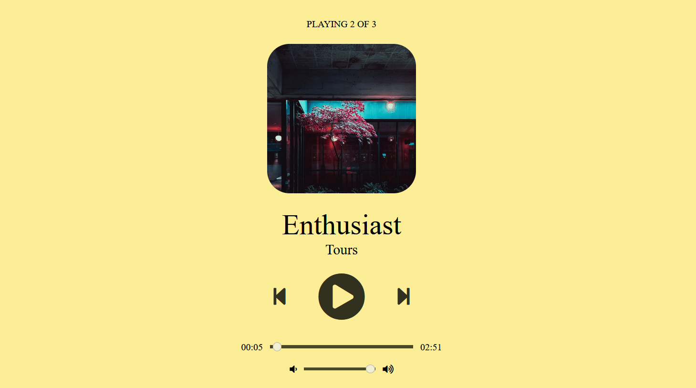

# Simple Music Player

The Simple Music Player is a web-based application that allows you to play a list of tracks with a user-friendly interface. It includes basic controls like play, pause, previous, and next, as well as a seek bar to adjust the playback position and a volume control.



## Features

- Play, pause, skip to the previous or next track.
- Adjust the volume using a volume slider.
- Seek through a track using the seek slider.
- Display track information and album art.
- Automatically switch to a random background color when playing different tracks.

## Demo

You can check out a live demo of the Simple Music Player here: [Demo](https://geeekdude.github.io/Music-Player)

## Installation

1. Clone this repository to your local machine:

   ```bash
   git clone https://github.com/geeekdude/Music-Player.git
   ```
2. Open the project folder:
    ```
    cd Music-Player
    ```
3. Open the `index.html` file in a web browser to start using the Simple Music Player.

## Usage
- Click the play button to start playing the current track.
- Use the pause button to pause the playback.
- You can skip to the previous or next track using the corresponding buttons.
- Adjust the volume by moving the volume slider.
- Use the seek slider to seek to a specific position in the current track.
- Track information and album art are displayed in the interface.
- The background color changes randomly when playing different tracks.

## Customization
You can customize the player by modifying the `main.js` file. You can add more tracks to the `track_list` array, change the default background color, and more.

## Contributing
If you'd like to contribute to this project, please follow these steps:

1. Fork the repository
2. Create a new branch for your feature or bug fix: `git checkout -b feature/your-feature`
3. Make your changes and commit them: `git commit -m 'Add a new feature'`
4. Push to the branch: `git push origin feature/your-feature`
5. Create a Pull Request
## License
This project is licensed under the MIT License.

## Acknowledgments
- This project uses the Font Awesome icon library for the player controls.
- Album art images are provided by Pexels.
## Contact
If you have any questions or suggestions, feel free to contact us at prateeeek02@gmail.com.

Enjoy your music!

